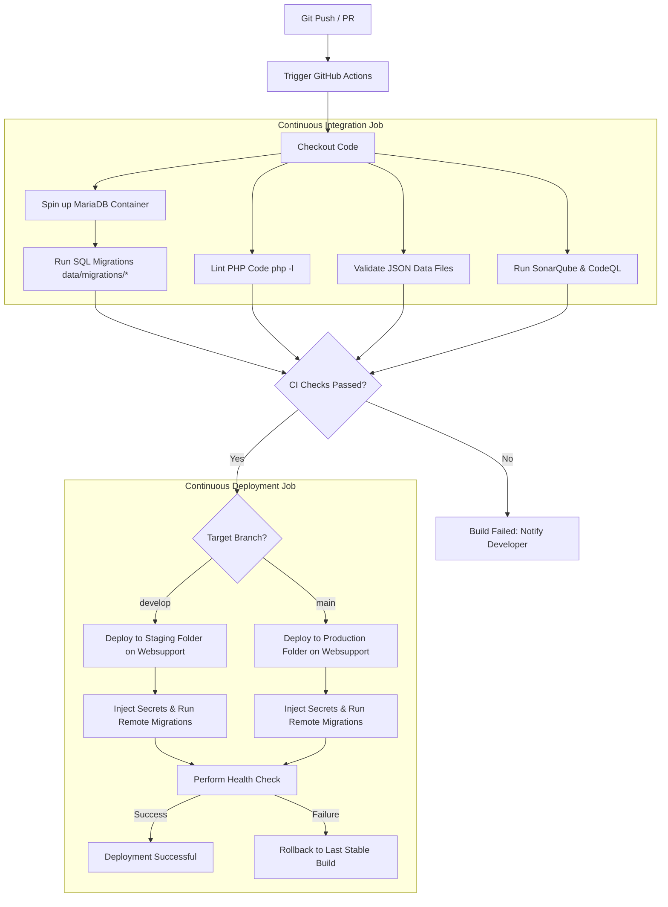

# User Story: Implement Robust CI/CD Pipeline for "Learn English Interactively"

## Story Description
**As a** Lead Developer / Product Owner,  
**I want to** establish an automated CI/CD pipeline for the "Learn English Interactively" website,  
**So that** we can automatically validate code formatting, check PHP syntax, verify JSON exercise files, test database migrations, and securely deploy updates to our **Websupport.sk** hosting server using **SSH/SFTP** without manual intervention.

---

## 1. Acceptance Criteria

### CI Phase (Continuous Integration)
- [x] **Automated Triggering**: The pipeline must run on every Pull Request to `develop` and `main`, and on direct pushes to `develop` and `main`.
- [ ] **Linting & Syntax Checks**:
  - All PHP scripts (e.g., `api.php`, config templates) must pass syntax linting (`php -l`).
  - Frontend code (JS, HTML, CSS) must pass code linting (e.g., ESLint for JavaScript, Stylelint for CSS) to maintain style consistency.
- [ ] **JSON Validation**:
  - An automated check must run to ensure all static database files (such as `data/quests.json` and all json files in `data/A1/`) contain valid JSON formatting and adhere to the expected exercise schema.
- [ ] **Database Migration Verification**:
  - A test runner must spin up a temporary MariaDB container in GitHub Actions.
  - The pipeline must execute all SQL files in `data/migrations/` sequentially against this container to verify schema creation and ensure no syntax or key constraints errors exist.
- [ ] **Security Checks**:
  - The static security analysis workflows (**SonarQube/SonarCloud** and **CodeQL**) must be fully integrated and block PR merge if critical vulnerabilities are introduced.

### CD Phase (Continuous Deployment)
- [ ] **Automated Deployment via SSH/SFTP**:
  - **Staging / Production**: Pushes/merges to target branches deploy automatically to the target directories on **Websupport.sk** using secure SSH keys.
- [ ] **Secrets & Configuration Security**:
  - The production `db_config.php` must **never** be checked into Git. The pipeline must securely compile `db_config.php` on the server using Websupport database connection secrets stored in GitHub Actions.
- [ ] **Post-Deployment Verification**:
  - Apply migrations automatically on the Websupport MariaDB database.
  - Perform a basic health check (HTTP GET on `api.php?action=get_session`) to ensure the server is responsive and database connectivity is successful.
- [ ] **Rollback Capability**:
  - If a deployment fails or the health check fails, the pipeline must automatically abort and rollback to the previous stable release.

---

## 2. Recommended Pipeline Architecture (GitHub Actions)

The workflow is split into two primary jobs: **Verify** (CI) and **Deploy** (CD).



---

## 3. Detailed Technical Requirements

### A. Static Code & Data Verification
1. **PHP 8.x Syntax Linter**:
   - Runs on a standard runner using `shivammathur/setup-php@v2` configured for PHP 8.x.
   - Command: `find . -name "*.php" -not -path "*/vendor/*" | xargs -n 1 php -l`
2. **JSON Data Validator**:
   - A custom lint script (Node.js or Python) will scan files in `data/` and `data/A1/` to ensure they can be successfully parsed.
3. **Frontend Linting**:
   - Introduce light-weight ESLint and Stylelint setups using a `package.json` file in the root, which defines local developers' tooling dependencies.

### B. Database Migration Sandbox
- Spin up a MariaDB service container in GitHub Actions:
  ```yaml
  services:
    mariadb:
      image: mariadb:10.6
      env:
        MYSQL_ROOT_PASSWORD: root
        MYSQL_DATABASE: learn_english_test
      ports:
        - 3306:3306
  ```
- Run a shell runner script to execute:
  1. `mysql -h 127.0.0.1 -u root -proot learn_english_test < data/migrations/01_add_gamification_columns.sql`
  2. `mysql -h 127.0.0.1 -u root -proot learn_english_test < data/migrations/02_add_daily_quests.sql`
  *(And any future migration files in numerical order).*

### C. Deployment Setup (Websupport.sk SSH / Rsync)
- **Deployment Action**: `easingthemes/ssh-deploy` or standard SSH commands in GitHub Actions.
- **Environment config injection**:
  - The pipeline logs into Websupport hosting via SSH Key.
  - It creates/updates the `db_config.php` using repository secrets:
    ```php
    <?php
    define('DB_HOST', '${{ secrets.WEBSUPPORT_DB_HOST }}');
    define('DB_NAME', '${{ secrets.WEBSUPPORT_DB_NAME }}');
    define('DB_USER', '${{ secrets.WEBSUPPORT_DB_USER }}');
    define('DB_PASS', '${{ secrets.WEBSUPPORT_DB_PASS }}');
    ```
- **Post-Deploy Migration Run**:
  - The workflow runs a script on the server (or uses a CLI connection) to execute any new `.sql` migrations against the remote Websupport database since the last deployment.
